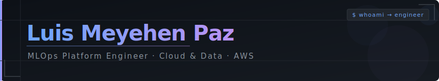

  

  
  &nbsp;
  
  &nbsp;
  

 

## `> about`

MLOps Platform Engineer with **7+ years** in data and cloud engineering. I specialize in building end-to-end ML platforms on AWS for Data Science teams — from infrastructure and IaC to model deployment, CI/CD pipelines, and LLM-based developer tooling.

Currently **MLOps / Cloud Engineer at [Interbank](https://interbank.pe)** (Peru · remote), leading cloud-native platform initiatives using AWS SageMaker, CDK, and AI tooling.

 

## `> experience`

<table>
  <tr>
    <td><b>Role</b></td>
    <td><b>Company</b></td>
    <td><b>Period</b></td>
    <td><b>Location</b></td>
  </tr>
  <tr>
    <td>MLOps / Cloud Engineer</td>
    <td>Interbank</td>
    <td>2023 – Present</td>
    <td>Peru · Remote</td>
  </tr>
  <tr>
    <td>Data Engineer</td>
    <td>Prisma Medios de Pagos</td>
    <td>2022 – 2023</td>
    <td>Argentina</td>
  </tr>
  <tr>
    <td>Data Engineer</td>
    <td>Tiendanube</td>
    <td>2021 – 2022</td>
    <td>Argentina</td>
  </tr>
  <tr>
    <td>Data Engineer</td>
    <td>Walmart Argentina</td>
    <td>2021</td>
    <td>Argentina</td>
  </tr>
  <tr>
    <td>Data Engineer</td>
    <td>Freelance</td>
    <td>2019 – 2021</td>
    <td>Argentina</td>
  </tr>
</table>

 

## `> stack`

<table>
  <tr>
    <td align="center" width="96">
      
       <b>AWS</b>
    </td>
    <td align="center" width="96">
      
       <b>Python</b>
    </td>
    <td align="center" width="96">
      
       <b>Docker</b>
    </td>
    <td align="center" width="96">
      
       <b>Terraform</b>
    </td>
    <td align="center" width="96">
      
       <b>Airflow</b>
    </td>
    <td align="center" width="96">
      
       <b>Spark</b>
    </td>
    <td align="center" width="96">
      
       <b>SQL</b>
    </td>
    <td align="center" width="96">
      
       <b>Bash</b>
    </td>
  </tr>
  <tr>
    <td align="center" width="96">
      
       <b>Kubernetes</b>
    </td>
    <td align="center" width="96">
      
       <b>FastAPI</b>
    </td>
    <td align="center" width="96">
      
       <b>Git</b>
    </td>
    <td align="center" width="96">
      
       <b>Streamlit</b>
    </td>
    <td align="center" width="96">
      
       <b>Flask</b>
    </td>
    <td align="center" width="96">
      
       <b>Linux</b>
    </td>
    <td align="center" width="96">
      
       <b>Redis</b>
    </td>
    <td align="center" width="96">
      
       <b>Elastic</b>
    </td>
  </tr>
</table>

 

## `> featured projects`

  

 

## `> github stats`

