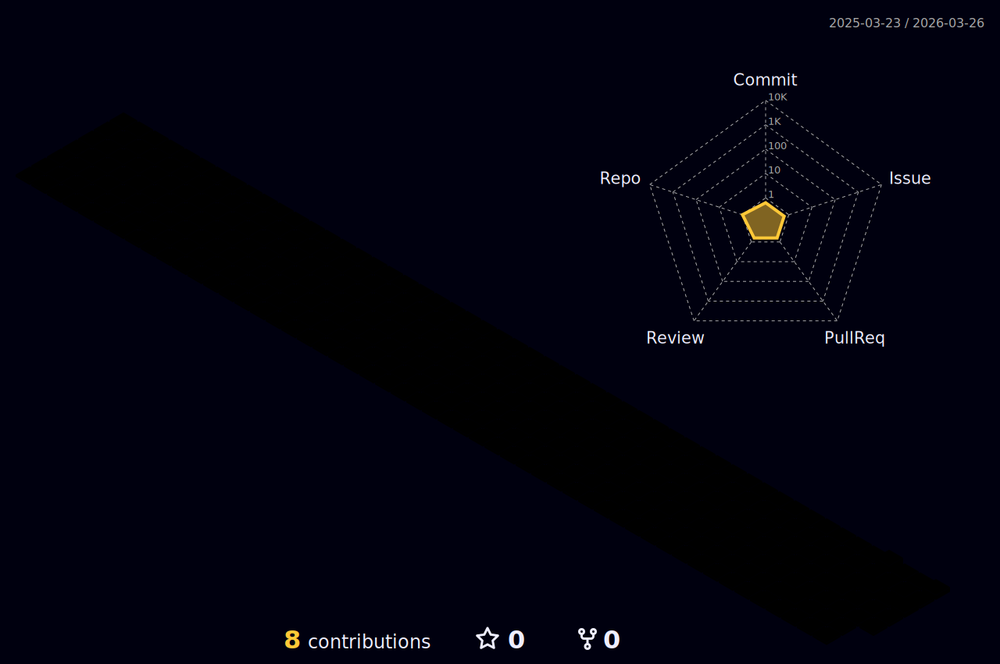

<div align="center">


</div>

---

I build the infrastructure that lets Data Science teams **ship models to production without friction** — scalable, self-service, and fully automated on AWS. 7+ years across data engineering and cloud, currently focused on MLOps platforms and AI-augmented developer workflows.

**Buenos Aires, Argentina** &nbsp;·&nbsp; Open to remote opportunities globally.

<div align="center">

[](https://linkedin.com/in/luisarg03)
&nbsp;
[](mailto:luis.m.paz.03@gmail.com)
&nbsp;
[](https://github.com/luisarg03)

</div>

---

### Stack

<div align="center">


</div>

---

→ Design and build **self-service MLOps platforms on AWS** — end to end, from IaC to model serving<br/>
→ Automate ML workflows so Data Science teams **ship to production without ops dependency**<br/>
→ Integrate **AI tooling into engineering workflows** to cut delivery cycles and improve developer experience

---

### Coding activity

<!--START_SECTION:waka-->
📊 **This Week I Spent My Time On** 

```text
💬 Programming Languages: 
Python                   3 hrs 13 mins       ████████████░░░░░░░░░░░░░   46.73 % 
Markdown                 2 hrs 19 mins       ████████░░░░░░░░░░░░░░░░░   33.64 % 
YAML                     43 mins             ███░░░░░░░░░░░░░░░░░░░░░░   10.57 % 
JSON                     28 mins             ██░░░░░░░░░░░░░░░░░░░░░░░   06.97 % 
SQL                      3 mins              ░░░░░░░░░░░░░░░░░░░░░░░░░   00.73 % 
```


<!--END_SECTION:waka-->

---

### GitHub

<div align="center">


</div>

<!--START_SECTION:github-stats-->
<div align="center">

| Metric | Value |
|--------|-------|
| Public Repos | 3 |
| Total Stars | 0 |
| Followers | 3 |
| Following | 3 |

*Last updated: 2026-03-27 19:34 UTC*

</div>
<!--END_SECTION:github-stats-->


---

### Contribution Calendar

<div align="center">



</div>

<br>