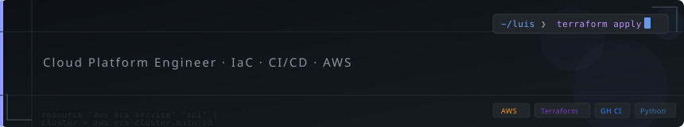
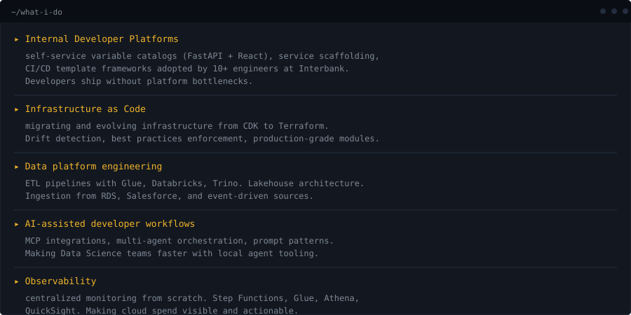
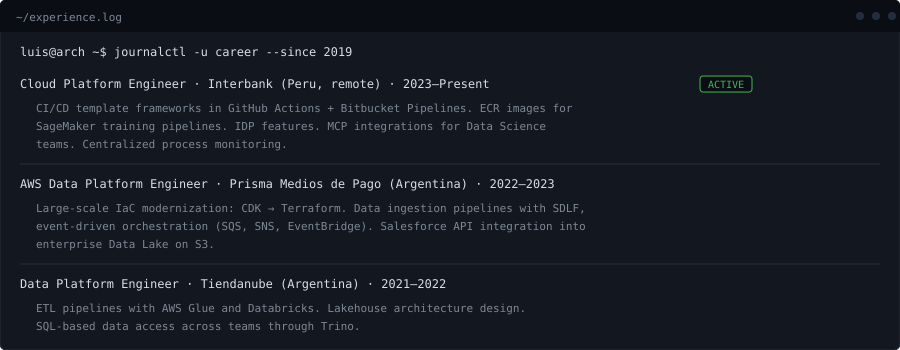
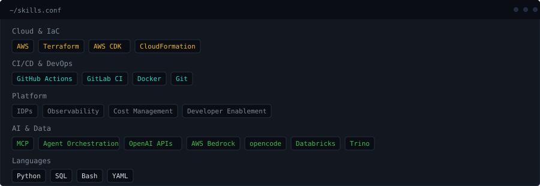

 

&nbsp;

&nbsp;

---

**Engineer who builds the platform AND the tooling that makes teams faster.**

Cloud Platform Engineer based in Buenos Aires, Argentina. 7+ years on AWS — from infrastructure as code to data pipelines to AI-assisted developer workflows. Quiet places 🏕️ · Techie · Tinkerer of systems that should just work.

---

---

Full career arc

**Data Engineer** · Walmart / Dorinka · 2021 — data migration and server decommissioning during Walmart Argentina's transition.

**Data Engineer** · Tsoft · 2020–2021 — automation processes for DirectTV data ingestion via APIs.

**Data Engineer** · Monsun · 2020 — predictive models (SQL Server), ETL pipelines (Pentaho) for Banco Supervielle and AGIP.

**Data Engineer** · Dthink · 2019–2020 — SQL Server databases, ETL with SSIS, Power BI and Metabase dashboards.

---

#### Projects

▸ **[OpenDashboard](https://github.com/Luisarg03/OpenDashboard)** — Visualizer for OpenCode agent delegation chains, costs, and token usage. TypeScript.

▸ **[NexoCode](https://github.com/Luisarg03/NexoCode)** — AI-powered coding agent. Fork of opencode. TypeScript.

▸ **[luisarg03.github.io](https://luisarg03.github.io)** — Personal portfolio site. Astro.

▸ **[projects-archive](https://github.com/Luisarg03/projects-archive)** — Archive of personal projects 2019→present: data science, web, cloud, ML, tools.

▸ **[sagemaker-cicd-poc](https://github.com/Luisarg03/sagemaker-cicd-poc)** — SageMaker CI/CD proof of concept. Python.

---

---

**AWS DevOps Engineer Professional** (in progress)

---

[`LinkedIn`](https://www.linkedin.com/in/luisarg03/) · [`GitHub`](https://github.com/Luisarg03) · [`Portfolio`](https://luisarg03.github.io) · `luis.m.paz.03@gmail.com`

