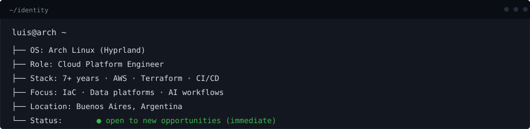

 

&nbsp;

&nbsp;

---

**Engineer who builds the platform AND the tooling that makes teams faster.**

Cloud Platform Engineer based in Buenos Aires, Argentina. 7+ years on AWS — from infrastructure as code to data pipelines to AI-assisted developer workflows. Quiet places 🏕️ · Techie · Tinkerer of systems that should just work.

---

#### What I do

▸ **Internal Developer Platforms** — self-service variable catalogs (FastAPI + React), service scaffolding, CI/CD template frameworks adopted by 10+ engineers at Interbank. Developers ship without platform bottlenecks.

▸ **Infrastructure as Code** — migrating and evolving infrastructure from CDK to Terraform. Drift detection, best practices enforcement, production-grade modules.

▸ **Data platform engineering** — ETL pipelines with Glue, Databricks, Trino. Lakehouse architecture. Ingestion from RDS, Salesforce, and event-driven sources.

▸ **AI-assisted developer workflows** — MCP integrations, multi-agent orchestration, prompt patterns. Making Data Science teams faster with local agent tooling.

▸ **Observability** — centralized monitoring from scratch. Step Functions, Glue, Athena, QuickSight. Making cloud spend visible and actionable.

---

#### Experience

**Cloud Platform Engineer** · Interbank (Peru, remote) · 2023–Present

CI/CD template frameworks in GitHub Actions + Bitbucket Pipelines. ECR images for SageMaker training pipelines. IDP features. MCP integrations for Data Science teams. Centralized process monitoring.

**AWS Data Platform Engineer** · Prisma Medios de Pago (Argentina) · 2022–2023

Large-scale IaC modernization: CDK → Terraform. Data ingestion pipelines with SDLF, event-driven orchestration (SQS, SNS, EventBridge). Salesforce API integration into enterprise Data Lake on S3.

**Data Platform Engineer** · Tiendanube (Argentina) · 2021–2022

ETL pipelines with AWS Glue and Databricks. Lakehouse architecture design. SQL-based data access across teams through Trino.

Full career arc

**Data Engineer** · Walmart / Dorinka · 2021 — data migration and server decommissioning during Walmart Argentina's transition.

**Data Engineer** · Tsoft · 2020–2021 — automation processes for DirectTV data ingestion via APIs.

**Data Engineer** · Monsun · 2020 — predictive models (SQL Server), ETL pipelines (Pentaho) for Banco Supervielle and AGIP.

**Data Engineer** · Dthink · 2019–2020 — SQL Server databases, ETL with SSIS, Power BI and Metabase dashboards.

---

#### Projects

▸ **[OpenDashboard](https://github.com/Luisarg03/OpenDashboard)** — Visualizer for OpenCode agent delegation chains, costs, and token usage. TypeScript.

▸ **[NexoCode](https://github.com/Luisarg03/NexoCode)** — AI-powered coding agent. Fork of opencode. TypeScript.

▸ **[luisarg03.github.io](https://luisarg03.github.io)** — Personal portfolio site. Astro.

▸ **[projects-archive](https://github.com/Luisarg03/projects-archive)** — Archive of personal projects 2019→present: data science, web, cloud, ML, tools.

▸ **[sagemaker-cicd-poc](https://github.com/Luisarg03/sagemaker-cicd-poc)** — SageMaker CI/CD proof of concept. Python.

---

---

**AWS DevOps Engineer Professional** (in progress)

---

[`LinkedIn`](https://www.linkedin.com/in/luisarg03/) · [`GitHub`](https://github.com/Luisarg03) · [`Portfolio`](https://luisarg03.github.io) · `luis.m.paz.03@gmail.com`

