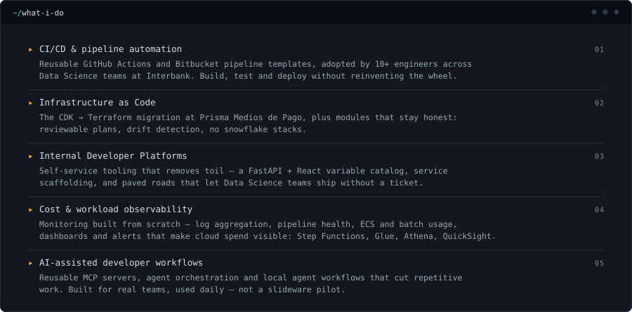
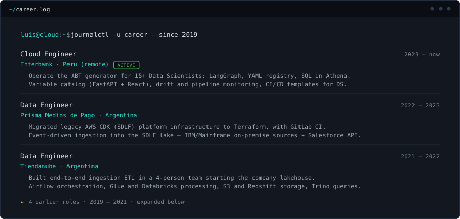
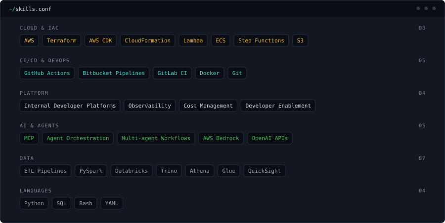

## `~/positioning`

<strong>I build the platform — and the tooling that makes teams faster on it.</strong>

Cloud Platform Engineer working where infrastructure as code, CI/CD and internal developer platforms meet: Terraform and CDK, GitHub Actions, cost and workload observability, and AI-assisted developer workflows. Seven years on AWS, the last three building platform tooling for Data Science teams at Interbank. Buenos Aires, Argentina · remote-first.

Outside the terminal: quiet places, and tinkering with systems that should just work.

## `~/experience`

Earlier roles · 2019 – 2021

- <strong>Data Engineer</strong> · Walmart / Dorinka · 2021 — data migration and database moves during the transition to Dorinka.
- <strong>Data Engineer</strong> · Tsoft · 2020–2021 — DirectTV: API-driven ingestion automation in Python.
- <strong>Data Engineer</strong> · Monsun · 2020 — Banco Supervielle (predictive models on SQL Server) and AGIP (Pentaho ETL).
- <strong>Data Engineer</strong> · Dthink · 2019–2020 — SQL Server and SSIS pipelines, Power BI and Metabase dashboards for three clients.

## `~/credentials`

- <strong>AWS Certified DevOps Engineer — Professional (DOP-C02)</strong> · in progress
- <strong>Data Architect</strong> · NTT Data Academy · 2024
- <strong>AWS Skill Builder</strong> · Cloud Practitioner Essentials, Developing on AWS, Well-Architected · completed

## `~/projects`

- <a href="https://github.com/Luisarg03/OpenDashboard"><strong>OpenDashboard</strong></a> — visualiser for OpenCode agent delegation chains: what each subagent did, what it cost, how many tokens it burned. <code>TypeScript</code>
- <a href="https://github.com/Luisarg03/dsh-memory-vault"><strong>dsh-memory-vault</strong></a> — persistent memory for DeepSeek Harness: an MCP server (SQLite FTS5 + Markdown) plus the <code>memory-mcp</code> and <code>memory-auto</code> plugins. <code>Python</code>
- <a href="https://github.com/Luisarg03/ArchCustomWidgets"><strong>ArchCustomWidgets</strong></a> — factory of installable widgets and services extending Caelestia (HyDE 3.x) on Arch Linux / Hyprland. <code>Shell</code>
- <a href="https://github.com/Luisarg03/tabimichi"><strong>tabimichi</strong></a> — 旅道 local discovery: tell it where you are and how long you have, it ranks nearby places by weather, time and taste. <code>TypeScript</code>
- <a href="https://github.com/Luisarg03/NexoCode"><strong>NexoCode</strong></a> — AI-powered coding agent, a fork of opencode. <code>TypeScript</code>
- <a href="https://github.com/Luisarg03/sagemaker-cicd-poc"><strong>sagemaker-cicd-poc</strong></a> — SageMaker training pipelines wired into CI/CD. <code>Python</code>

Everything from 2019 onwards — data science, web, cloud, ML — lives in <a href="https://github.com/Luisarg03/projects-archive">projects-archive</a>, and the site itself is <a href="https://luisarg03.github.io">luisarg03.github.io</a>.

## `~/skills`

## `~/contact`

<a href="https://www.linkedin.com/in/luisarg03/"><code>linkedin</code></a> · <a href="https://github.com/Luisarg03"><code>github</code></a> · <a href="https://luisarg03.github.io"><code>portfolio</code></a> · <a href="mailto:luis.m.paz.03@gmail.com"><code>luis.m.paz.03@gmail.com</code></a>
