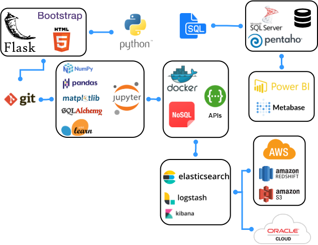

[![github][github-shield]][github-url] [![LinkedIn][linkedin-shield]][linkedin-url] [![instagram][instagram-shield]][instagram-url]

<!-- PROJECT LOGO -->
 

  

  <h2  align="center">Hi 👋, I'm Luis</h2>
  

    Welcome !!!
  
 

<!-- Acerca de mi -->
## Acerca de mi
Tengo 28 años, soy fan de la tecnología, los datos y la programación...
 
Desde que tengo memoria me llama ha llamado la atención la tecnología y como se aplica en
nuestras vidas diarias.
 
Actualmente mis metas están relacionadas en adquirir conocimiento acerca de como funcionan
internamente las áreas tecnológicas de las compañías, entender como aplican y aprovechan
para su crecimiento las nuevas tendencias tecnológicas que van surgiendo constantemene.
 

<!-- ROADMAP -->
## Skill Roadmap

### Languages and Tools:

[][webdevplaylist]
[][webdevplaylist]
[][cssplaylist]
[][cssplaylist]
[][jsplaylist]
[][reactplaylist]
[][webdevplaylist]
[][webdevplaylist]
[][webdevplaylist]
[][webdevplaylist]
[][webdevplaylist]
[][webdevplaylist]
[][webdevplaylist]
[][webdevplaylist]
[][webdevplaylist]
[][webdevplaylist]

 
 

<!-- VARS -->

[linkedin-shield]: https://img.shields.io/badge/LinkedIn-0077B5?style=for-the-badge&logo=linkedin&logoColor=white
[linkedin-url]: https://www.linkedin.com/in/luisarg03/

[github-shield]:https://img.shields.io/badge/GitHub-100000?style=for-the-badge&logo=github&logoColor=white
[github-url]:https://github.com/Luisarg03

[instagram-shield]:https://img.shields.io/badge/Instagram-E4405F?style=for-the-badge&logo=instagram&logoColor=white
[instagram-url]:https://www.instagram.com/hiro_lmp/
